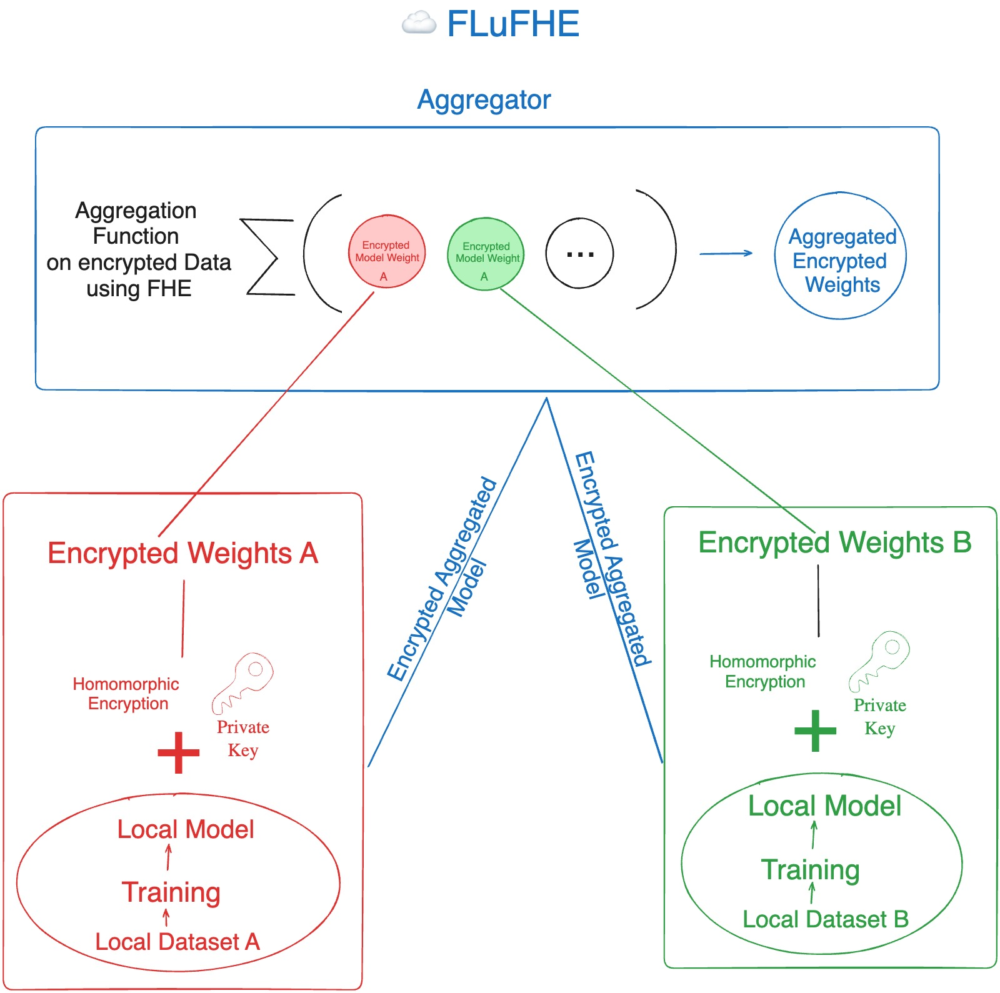
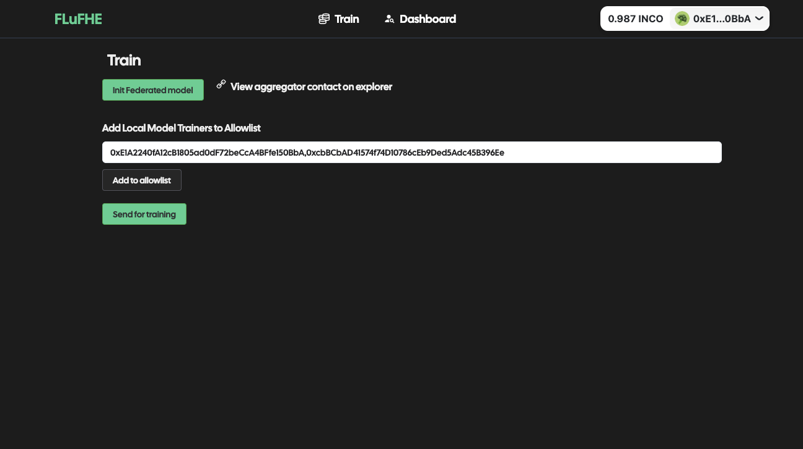
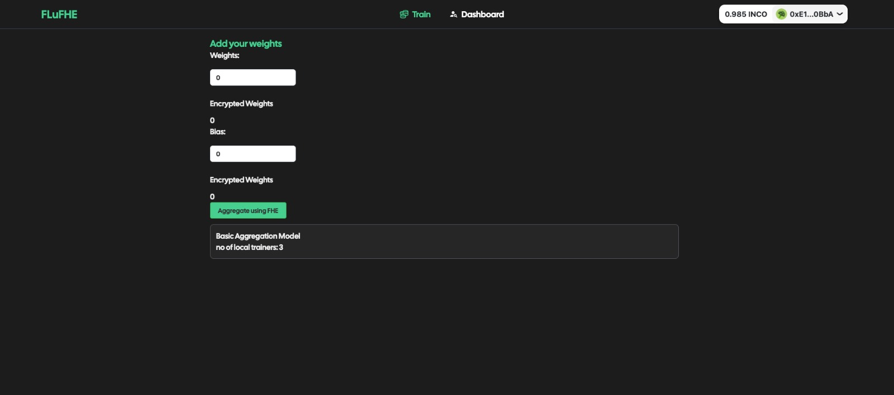

## FLuFHE - Federated Leaning using FHE

[A Video Demo is worth a thousand words 👾](https://vimeo.com/892092134?share=copy)

---
> FLuFHE - Federated Learning using FHE to use decentralized model training and protect it against inference and stealth attacks.
FLuFHE is an improvement built for federated learning (a way to compute ml models in a decentralised way). Federated learning models have a vulnerability that aggregator functions have access to weights and bias which is a security risk. To mitigate this we have used Fully Homomorphic encryption. FHE allows us to do operations on encrypted data leveraging this we have created encrypted weights and biases for local models which aggregators aggregates using FHE and never has access to the the original weights and bias . This makes it secure. To address compute limitations and onchain limitations we have provided an off chain FHE demo using concrete-ml which showcases how complex aggegration methods can be implemented using FHE. This offchain compute then can be verified in a number of ways like using RISC 0 bonsai relayer and Application-specific rollups with a Linux runtime like cartesi
---

FLuFHE leverages the power of Fully Homomorphic Encryption (FHE) to address security and privacy concerns in Federated Learning (FL). By performing aggregation on encrypted models, FLuFHE prevents the aggregator from accessing the actual model parameters, protecting against both inference attacks and stealth attacks.

## Federated Learning

Federated Learning is a decentralized machine learning approach that enables training models across multiple edge devices or servers without sharing raw data. It preserves privacy by keeping data local, allowing collaborative model improvement while maintaining data confidentiality.

## Issues with Federated Learning

- Model Poisoning: Malicious participants may inject biased or misleading data during the federated learning process to compromise the integrity of the collaborative model.

- Privacy Leakage: Attackers might exploit model updates to glean information about individual participants, compromising the privacy of sensitive data.

## Flufhe - improving Federated Learning using fully homomorphic encryption

Utilizing Fully Homomorphic Encryption (FHE) in Federated Learning models brings significant advantages. It ensures privacy preservation by allowing computations on encrypted data, enabling secure collaboration without exposing raw information. FHE compliance supports regulatory requirements, while also increasing data utility and facilitating distributed learning in untrusted environments. The reduced communication overhead further enhances the efficiency of Federated Learning processes. Overall, FHE strengthens the privacy, security, and collaborative aspects of Federated Learning models.

## Architecture 🤖

> This is how FHE can be used for Federated Learning

## Technologies 🎮
- FHE
- Federated Learning
- Concrete-pyhton by ZAMA
- FHEVM
- Solidity
- Python
- Numpy

## Screens
 > Model Init Screen

 > Add Encrypted Weights Data

#### Built by team Bruhma 👾
